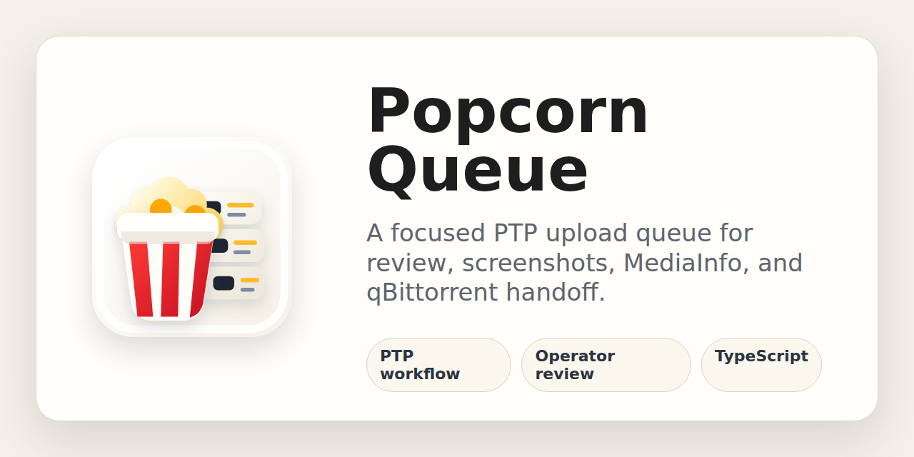
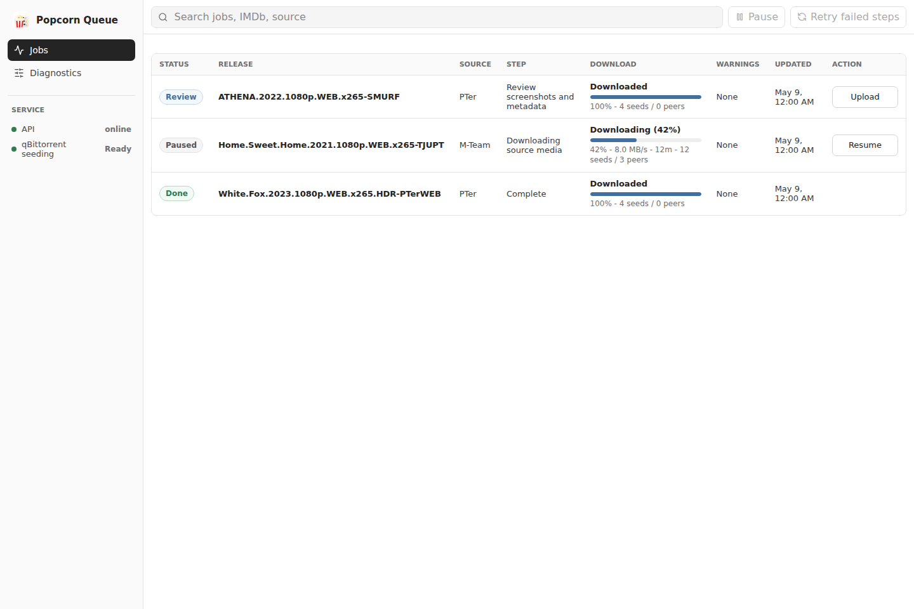
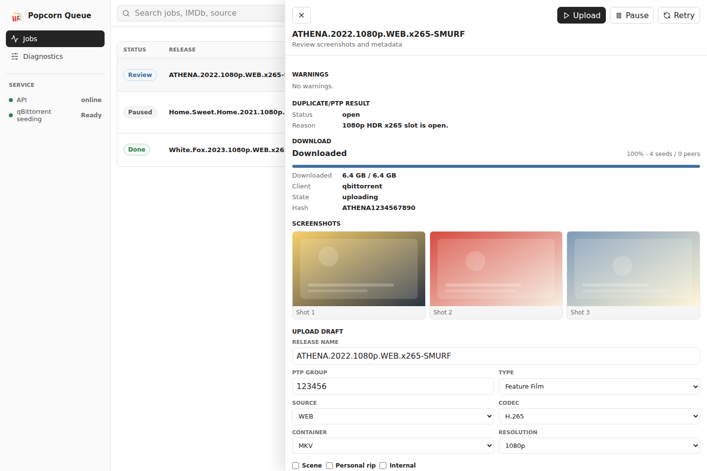
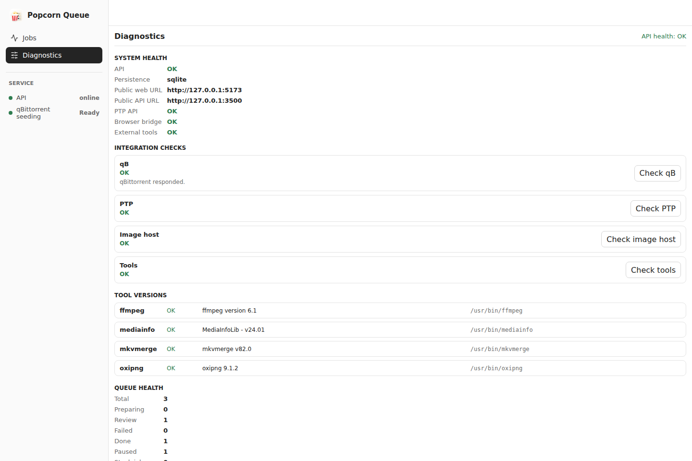

# Popcorn Queue

Popcorn Queue is a TypeScript rewrite of the PTP upload workflow: a browser bridge,
a PTP duplicate checker, a persistent upload queue, and a high-density web UI.



## Screenshots







All code for this new project lives under this directory. The legacy
`PtpUploader`, `ptp_checker`, and `Upload-Assistant` directories are reference-only.

## Apps

- `apps/api` exposes the browser bridge API, health checks, and job creation.
- `apps/web` is the QUI-style operator UI.
- `apps/worker` is the upload phase runner shell.
- `apps/userscript/popcorn-queue-bridge.user.js` is the new userscript name for the
  browser-side checker/uploader bridge.

## Packages

- `packages/core` contains shared types, release parsing, PTP cache keys, and the
  coexisting rule engine.
- `packages/integrations` contains PTP API access and browser-check orchestration.

## First Run

```bash
npm install
npm test
npm run typecheck
npm run test:e2e
npm run screenshots
npm run dev:web
npm run dev:api
```

The repo includes a local `.env` for this remote server and an `.env.example`
template. Automated tests use mocks and do not call PTP, TMDb, image hosts, or a
torrent client. For manual browser testing, install
`apps/userscript/popcorn-queue-bridge.user.js` in Tampermonkey and set the API
URL, web URL, and browser token from the userscript menu.

The main UI prepares jobs up to review automatically. Review screenshots,
MediaInfo/BDInfo, duplicate result, release draft, and torrent/qB readiness,
then press `Start Upload`. Debug phase controls live under Diagnostics only.

Logs are available through:

```bash
npm run logs:api
npm run logs:worker
npm run logs:job -- <jobId>
```

Release screenshots are generated from mock data and do not call external
services. Re-run `npm run screenshots` before refreshing README images or the
GitHub social preview.
